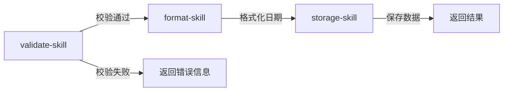

# DevOpsGPT - 跟进记录管理系统

基于微信小程序的客户跟进记录管理工具，支持记录的新增、查询、搜索、删除及统计。

## 功能特性

- 📋 跟进记录列表展示（分页加载）
- 🔍 关键词搜索
- ➕ 新增跟进记录
- 🗑️ 删除单条记录
- 📊 记录统计信息（总数、本月新增、待跟进）
- 🔄 下拉刷新
- 📱 底部安全区适配（iOS / Android）

## 技术栈

- 微信小程序原生框架
- Apifox Mock 接口管理（可选）
- localStorage 本地存储（默认）

## 项目结构

```
Project01/
├── app.js                  # 小程序入口
├── app.json                # 全局配置
├── app.wxss                # 全局样式（设计系统变量）
├── pages/
│   ├── followUpList/       # 跟进记录列表页
│   │   ├── followUpList.js
│   │   ├── followUpList.json
│   │   ├── followUpList.wxml
│   │   └── followUpList.wxss
│   ├── followUpAdd/        # 新增跟进记录页
│   │   ├── followUpAdd.js
│   │   ├── followUpAdd.json
│   │   ├── followUpAdd.wxml
│   │   └── followUpAdd.wxss
│   ├── index/              # 首页（默认模板）
│   └── logs/               # 日志页（默认模板）
└── utils/
    ├── api.js              # API 请求封装（支持本地兜底）
    ├── config.js           # 接口地址配置
    ├── util.js             # 工具函数
    └── skills/
        ├── storage-skill.js    # 本地存储管理
        ├── validate-skill.js   # 表单校验
        ├── format-skill.js     # 日期格式化
        └── mock-skill.js       # Mock 数据
```

## 快速开始

### 1. 克隆项目

```bash
git clone https://github.com/Awfy0521/Follow-Up-Manager
```

### 2. 导入微信开发者工具

1. 打开微信开发者工具
2. 选择 **「导入项目」**
3. 选择项目目录
4. AppID 填写你的小程序 ID（或使用测试号）
5. 点击 **「导入」**

### 3. 配置 Apifox Mock（可选）

默认使用 localStorage 本地存储，如需对接 Apifox Mock：

1. 在 [apifox.com](https://apifox.com) 创建项目
2. 导入接口（见下方 API 文档）
3. 开启 Mock 服务，复制 Mock URL
4. 修改 `utils/config.js`：

```js
const BASE_URL = 'https://mock.apifox.com/m1/你的Mock地址';
```

## API 接口

| # | Method | Path | 说明 |
|---|--------|------|------|
| 1 | GET | `/api/projects/:projectId/records` | 获取跟进记录列表（分页+搜索） |
| 2 | POST | `/api/projects/:projectId/records` | 新增跟进记录 |
| 3 | GET | `/api/records/:id` | 获取单条记录详情 |
| 4 | PUT | `/api/records/:id` | 更新跟进记录 |
| 5 | DELETE | `/api/records/:id` | 删除单条记录 |
| 6 | GET | `/api/projects/:projectId/records/stats` | 获取记录统计 |
| 7 | DELETE | `/api/records/batch` | 批量删除记录 |

### 请求/响应格式

**统一响应：**
```json
{
  "code": 0,
  "message": "success",
  "data": { ... }
}
```

**新增记录请求：**
```json
{
  "title": "沟通主题",
  "content": "沟通详情",
  "nextTime": "2024-06-10T14:00:00",
  "nextContent": "下次沟通内容"
}
```

**列表响应：**
```json
{
  "code": 0,
  "message": "success",
  "data": {
    "total": 3,
    "page": 1,
    "pageSize": 20,
    "list": [
      {
        "id": 1,
        "title": "星巴克咖啡面谈细节",
        "content": "沟通投资细节。",
        "date": "06-09",
        "nextTime": "2024-06-10T14:00:00",
        "nextContent": "跟进投资方案"
      }
    ]
  }
}
```

## 数据模型

| 字段 | 类型 | 必填 | 说明 |
|------|------|------|------|
| id | integer | — | 唯一标识 |
| title | string | ✅ | 沟通主题（1-50字符） |
| content | string | ✅ | 沟通详情（1-500字符） |
| date | string | — | 记录日期（MM-DD） |
| nextTime | string | — | 下次沟通时间（ISO 8601） |
| nextContent | string | — | 下次沟通内容 |

## AI Agent 工作流

本项目采用 **Skill 抽象 + 多角色协作** 的 AI Agent 工作流完成开发。

### Skill 设计理念

将复杂任务分解为可执行的 Skill（技能单元），每个 Skill 具备：
- **明确的输入输出**：接收参数，返回结构化结果
- **单一职责**：一个 Skill 只做一件事
- **可组合性**：多个 Skill 串联完成复杂流程

### 已实现的 Skill

| Skill | 职责 | 输入 | 输出 |
|-------|------|------|------|
| `storage-skill` | localStorage CRUD | 操作类型、数据 | 存储结果 |
| `validate-skill` | 表单校验 | 表单数据 | 校验结果 |
| `format-skill` | 日期格式化 | 原始日期 | 格式化字符串 |
| `mock-skill` | Mock 数据生成 | 无 | 测试数据集 |

### 工作流编排

```
需求分析 → 任务拆解 → Skill 编排 → 代码生成 → 质量验证
   ↓           ↓           ↓           ↓           ↓
 用户故事   Task列表   Skill组合   文件输出    测试通过
```

**实际案例：新增跟进记录功能**



### Skill 复用示例

```js
// 同一个 storage-skill 被多个页面复用
// followUpList.js - 查询
const records = storageSkill.getRecords({ keyword, page });

// followUpAdd.js - 新增
storageSkill.addRecord({ title, content, nextTime });

// followUpList.js - 删除
storageSkill.deleteRecord(id);
```

## 设计规范

### 配色

| 变量 | 值 | 说明 |
|------|-----|------|
| `--color-primary` | `#1A2332` | 深蓝主色 |
| `--color-accent` | `#4A90D9` | 蓝色强调 |
| `--color-success` | `#34A77B` | 成功绿 |
| `--color-bg` | `#F2F4F7` | 页面背景 |
| `--color-card` | `#FFFFFF` | 卡片背景 |
| `--color-text` | `#1A1D21` | 主文字 |
| `--color-text-secondary` | `#5F6B7A` | 辅助文字 |
| `--color-text-muted` | `#9DA5B0` | 弱化文字 |

### 间距

| 变量 | 值 |
|------|-----|
| `--radius-sm` | `12rpx` |
| `--radius-md` | `16rpx` |
| `--radius-lg` | `24rpx` |
